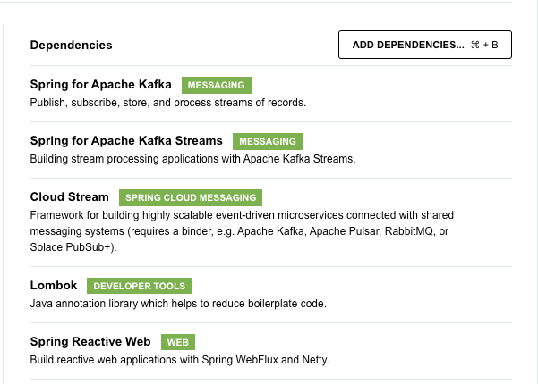

This purpose of this repo is to demostrate a spring boot application interacting with kafka running as part of Confluent Cloud. This example is developed using the Spring Kafka course, https://developer.confluent.io/courses/spring/apache-kafka-intro/

## Table of Contents

- [Getting Started](#getting-started)
  - [Prerequisites](#prerequisites)
  - [Project Setup](#project-setup)
- [Produce Messages](#produce-messages)
- [Consume Messages](#consume-messages)

## Getting Started

### Prerequisites

Ensure you have the following installed on your development machine:

- [Java Development Kit (JDK) 17](https://openjdk.java.net/)
- [Apache Maven](https://maven.apache.org/)

### Project Setup

1. Open https://start.spring.io/

2. Choose options based on the screenshot listed here . We recommend to use the values mentioned in the screenshot as it makes it easy to follow the rest of the instructions.

3. Add dependencies based on the screenshot listed here 

4. Click the Generate button to download the package(zip file) to a folder of your choice. If you used the values shown in the screenshot, the generated filename will be spring-ccloud-maven.zip.  

5. unzip the package to extract the file contents to a folder, spring-ccloud-maven

6. `cd spring-ccloud-maven`

7. Open pom.xml and add the below dependency to the `<dependencies>` section. This library is used to send random quotes as messages to kafka. More info about this library can be found at https://github.com/DiUS/java-faker
```
    <dependency>
        <groupId>com.github.javafaker</groupId>
        <artifactId>javafaker</artifactId>
        <version>1.0.2</version>
    </dependency>
```

8. Open application.properties under src/main/resources. Add the below content to it.
```
# Kafka
spring.kafka.properties.sasl.mechanism=PLAIN
spring.kafka.bootstrap-servers=<TOBEFILLED>
spring.kafka.properties.sasl.jaas.config=org.apache.kafka.common.security.plain.PlainLoginModule required username='<TOBEFILLED>' password='<TOBEFILLED>';
spring.kafka.properties.security.protocol=SASL_SSL

spring.kafka.producer.key-serializer=org.apache.kafka.common.serialization.IntegerSerializer
spring.kafka.producer.value-serializer=org.apache.kafka.common.serialization.StringSerializer
spring.kafka.producer.client-id=spring-boot-producer

spring.kafka.consumer.key-deserializer=org.apache.kafka.common.serialization.IntegerDeserializer
spring.kafka.consumer.value-deserializer=org.apache.kafka.common.serialization.StringDeserializer

# User defined
topic.name=users
spring.kafka.consumer.group-id=my-group
```
The values for <TOBEFILLED> will be provided by the workshop instructor/moderator

## Produce Messages

In this module we add logic to produce messages to a kafka topic. 

1. Create a new java class, Producer.java under src/main folder in io.confluent.developer.springccloud package. The location should look like in the screenshot below 


Copy the below code to Producer.java

```java
package io.confluent.developer.springccloud;

import java.time.Duration;
import java.util.stream.Stream;

import org.springframework.beans.factory.annotation.Value;
import org.springframework.boot.context.event.ApplicationStartedEvent;
import org.springframework.context.event.EventListener;
import org.springframework.kafka.core.KafkaTemplate;
import org.springframework.stereotype.Component;

import com.github.javafaker.Faker;

import lombok.RequiredArgsConstructor;
import reactor.core.publisher.Flux;

@RequiredArgsConstructor
@Component
public class Producer {

    @Value("${topic.name}")
    private String topic;

    private final KafkaTemplate<Integer, String> template;

	Faker faker;

	@EventListener(ApplicationStartedEvent.class)
	public void generate() {

		faker = Faker.instance();
		final Flux<Long> interval = Flux.interval(Duration.ofMillis(1_000));

		final Flux<String> quotes = Flux.fromStream(Stream.generate(() -> faker.hobbit().quote()));

		Flux.zip(interval, quotes)
                .map(it -> {
                    System.out.println("Sending message: " + it.getT2());
                    return template.send(topic, faker.random().nextInt(42), it.getT2());
                })
                .blockLast();
	}
}
```

2. Being in the root folder in spring-ccloud-maven, run `mvn package`

3. If you see messages on the console with the prefix `Sending message: ` followed by a random quote, then the data was successfully published to kafka topics. If you see any errors in the console, please check with the instructor/moderator.

4. Messages should appear in the relevant topic. Open CClould UI, go to the relevant cluster and click on the corresponding topic. Your instructor/moderator will be able to help with this check.

5. Once you validate that the messages are successfully produced you can hit ctrl+c to exit out of the maven process.

## Consume Messages

In this module we add logic to consume messages from a kafka topic. 

1. Create a new java class, Consumer.java under src/main folder in io.confluent.developer.springccloud package. The location should look like in the screenshot below 


Copy the below code to Consumer.java

```java
package io.confluent.developer.springccloud;

import org.apache.kafka.clients.consumer.ConsumerRecord;
import org.springframework.kafka.annotation.KafkaListener;
import org.springframework.stereotype.Component;

@Component
public class Consumer {
    
    @KafkaListener(topics = "${topic.name}", groupId = "${spring.kafka.consumer.group-id}")
    public void consume(ConsumerRecord<Integer, String> record) {
        System.out.println("received = " + record.value() + " with key " + record.key());
      }
}
```

2. Being in the root folder in spring-ccloud-maven, run `mvn package`

3. If everything is succesful, you should see messages in the console with the term `received = `. If you do not see this or see any errors, please check with your instructor/moderator.

4. Once you validate that the messages are successfully consumed you can hit ctrl+c to exit out of the maven process.

